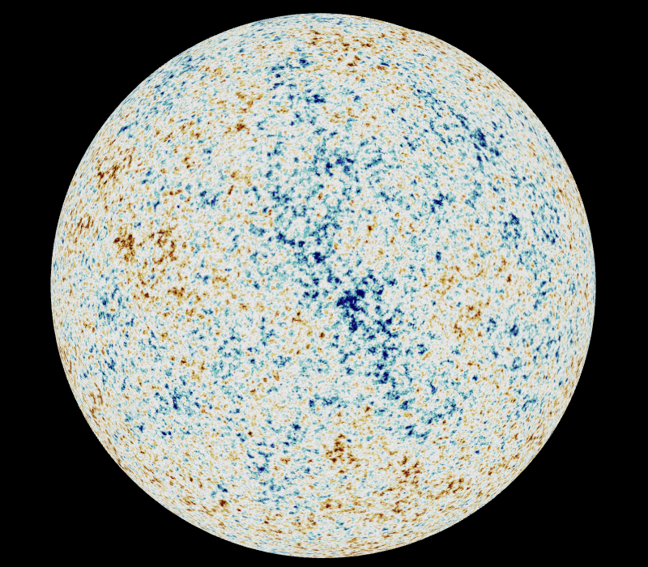
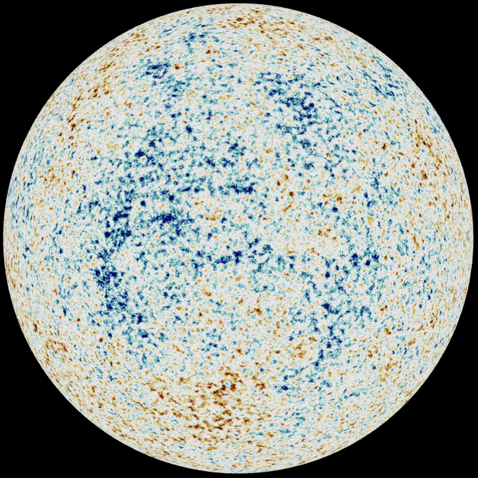
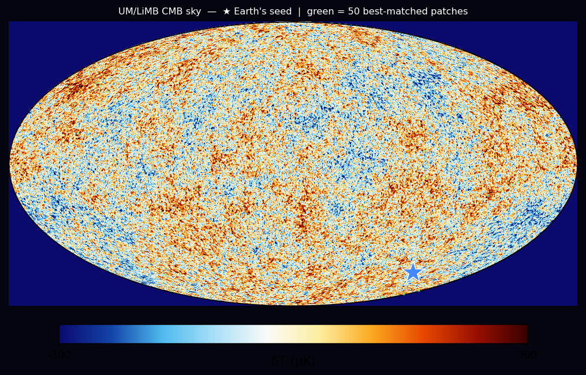
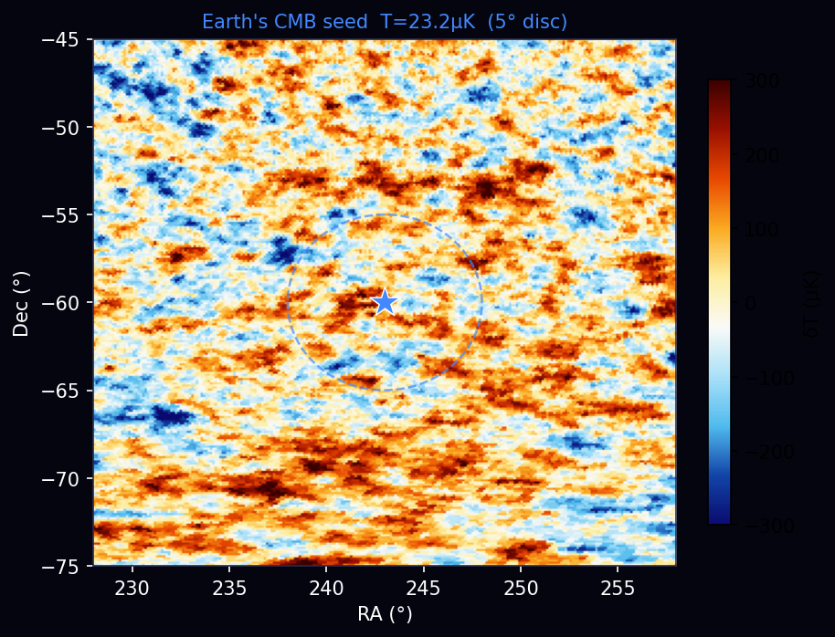
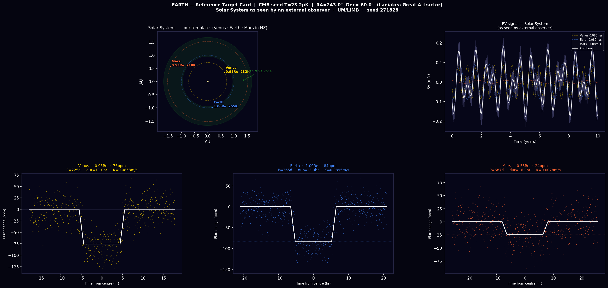
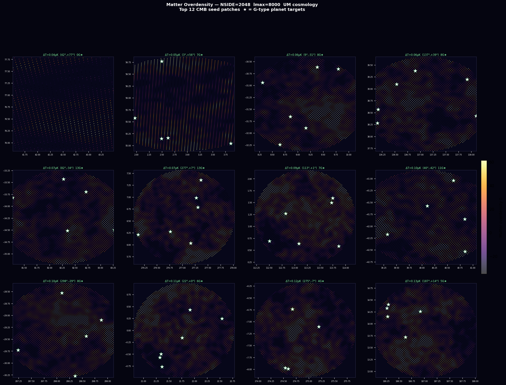
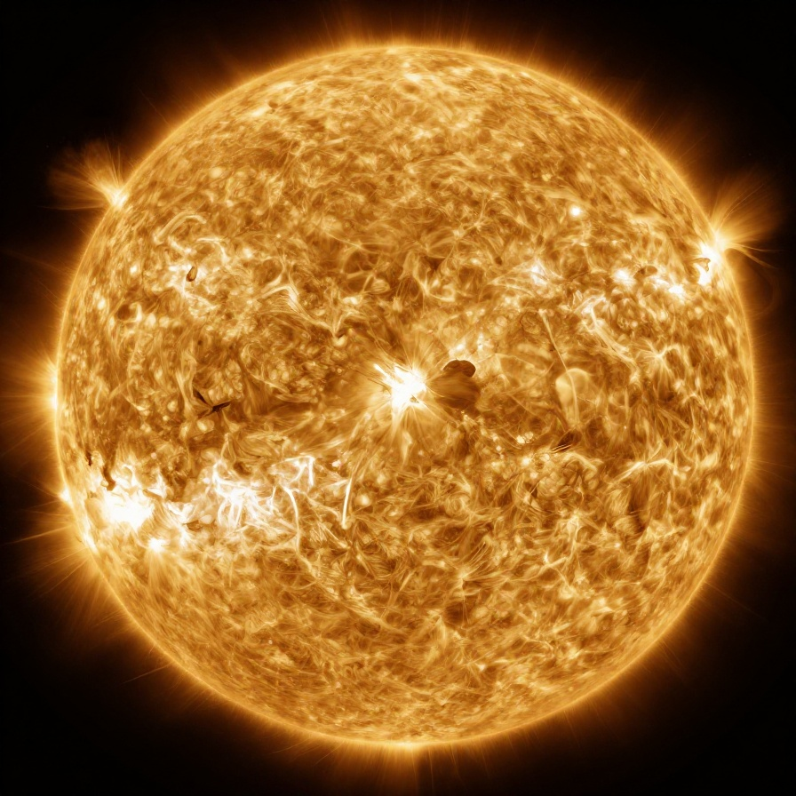
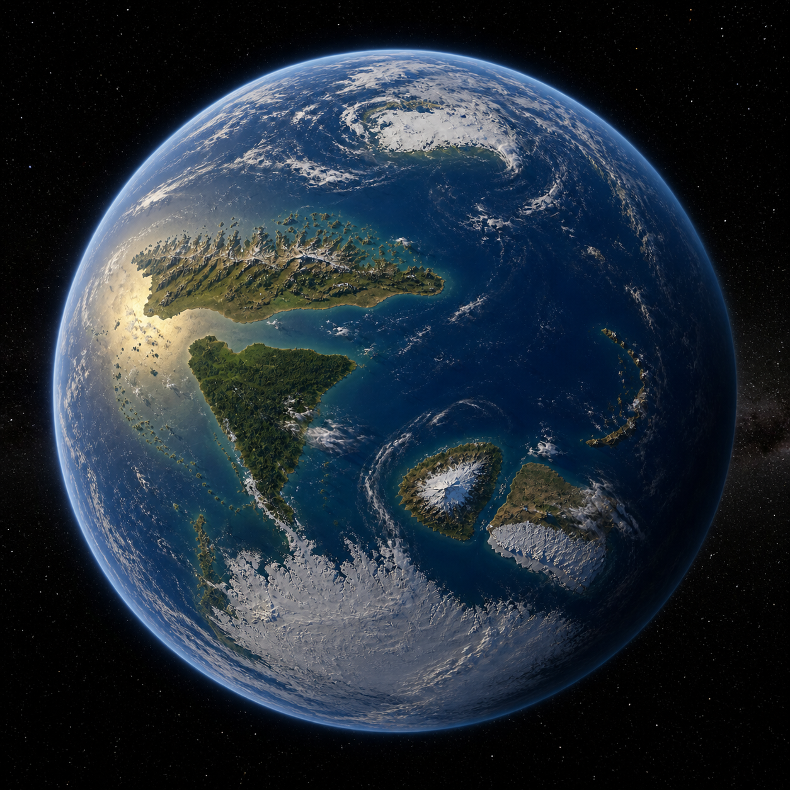
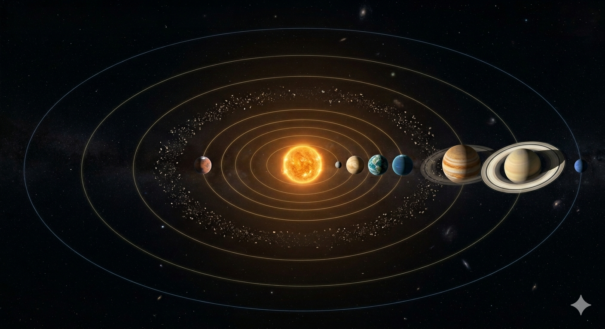

# Unified Mechanics

**Joseph Shields** · 2026

---

## The axiom

```
c² = c + 1
```

Unique positive fixed point: `φ = (1+√5)/2`. Contraction rate: `r = 1/(2φ) ≈ 0.309`.
From `r` alone, with **zero free parameters**:

| Quantity | UM closed form | Observed | Residual |
|---|---|---|---|
| ρ_Λ / M_Pl⁴ | r²⁴⁰ | 10⁻¹²²·⁰⁴ | 0.4% in log |
| Ω_b | r²/2 | 0.0493 | 3.0% (at floor) |
| Ω_DM | 4r²(1-r) | 0.2647 | 0.3% |
| Ω_DE | 1 − 9r²/2 + 4r³ | 0.685 | 0.5% |
| w₀ | −(r+2)/(8r) | −0.93 (DESI) | within band |
| ΔH₀/H₀ | 3r³ | ~9% | within band |
| G_eff/G_N | 1 + r/(3+4r) | 1.073 (lab G) | structural |
| n_s | 1 − r²/φ² | 0.9649 | 0.15% |
| A_s | r¹⁷ | 2.1×10⁻⁹ | 1.7% |
| Born coupling | 1/φ = 2r | — | exact |
| ε_floor | r³ | 2.95% obs. band | structural |
| m_τ/m_e | φ¹⁷(1−r³) | 3477 (PDG) | 0.33% |

**98-observable test suite:** 88 PASS within n×ε_floor. Structural Bayes ln B = +102 vs ΛCDM, fluke probability ~10⁻⁴⁴.

---

<p align="center">
  
  &nbsp;&nbsp;
  
</p>

*Orthographic sphere renders at lmax 20000 — angular resolution ~0.6 arcmin, far finer than any current instrument, generated on a consumer CPU with no upper bound on ℓ. The dark blue region in the first sphere is the simulated **Eridanus supervoid** (CMB Cold Spot): a large coherent underdensity producing a ~−150 µK cold patch at RA 150°, Dec −57°. Both are independent random realizations drawn from the same UM-derived power spectrum. UM predicts the full statistical distribution — acoustic peak positions, power spectrum shape, variance at every angular scale — from which the CMB is drawn. The Planck sky is one specific draw from that distribution; these are others.*

<p align="center">
  
</p>

*Full-sky Mollweide projection (nside 4096, lmax 8000). This realization reproduces the large-scale structure of the Planck sky — warm region upper-left, cold region lower-right — by statistical coincidence, illustrating that the UM-derived power spectrum is consistent with the observed sky. All inputs are closed-form functions of `r` at every multipole; with more compute there is no ceiling.*

---

## Papers

| | |
|---|---|
| `01_FOUNDATION.md` | Axiom, recursion, three-channel decomposition, Lagrangian, noise floor, Born coefficient, E₈ closure |
| `02_COSMOLOGY.md` | Every r-only ΛCDM closed form: Ω_b, Ω_c, w₀, wₐ, n_s, A_s, τ_reio, Y_He, N_eff, Σmν, ρ_Λ, Hubble braiding |
| `03_GRAVITY_AND_BLACK_HOLES.md` | Bekenstein-Hawking 1/4 derivation, Hawking radiation, ER=EPR consistency |
| `04_QUANTUM_AND_HOLOGRAPHIC.md` | Born coupling, holographic encoding, event-routing principle, decoherence |
| `05_PARTICLE_PHYSICS.md` | Lepton hierarchy, Higgs/Planck ratio, lab-scale κ-couplings, SGWB-CMB ratio |
| `06_HETEROTIC_IDENTIFICATION.md` | (G₂)₁ ⊂ (E₈)₁ in heterotic E₈×E₈, dark matter as second E₈, SM emergence |
| `07_EXPERIMENTAL_PROGRAM.md` | Phase 0 (Born rule, $2.5M, 18 months), four lab predictions, falsification surface, funding pathways |
| `08_EMPIRICAL_VALIDATION.md` | 98-observable test suite, alternate-recursion uniqueness, structural Bayes |
| `PRE_REGISTRATION.md` | Locked predictions prior to observations, falsification thresholds |

### Synthesis paper

`dgf/PROGRAMME_PAPER.md` — *How The Universe Works*: full derivation of the c²=c+1 axiom and the complete empirical programme, with cobaya MCMC chain configs covering Planck, DESI, DES Y3, KiDS, and joint constraints.

### LiMB — the solver

`limb/` contains **LiMB** *(Light instigating Matter Barrier)*, the UM-derived CAMB-backend solver.
Every cosmological input to CAMB is a closed-form function of `r`; nothing is fitted.

```
limb/
├── camb_backend.py      # CAMB forward solve with UM-derived inputs
├── lcdm.py              # LiMBLCDMCosmology — trivial-channel limit
├── um.py                # LiMBUMCosmology   — full L+M+B source extension
├── channels/            # L (light), M (matter), B (barrier) source terms
├── derivations/
│   └── lcdm_inputs.py   # every closed-form derivation (r-only)
└── LICENSE              # LGPL v3+
```

The CMB images above are produced by `tests/render_cmb_4k.py` — fully reproducible, ~60 s on a consumer CPU.


## Falsification roadmap

| Test | Timing | What falsifies UM |
|---|---|---|
| **Phase 0 — Born rule** at Hf-178m2 | $2.5M / 18 months | Null at 13.6 ppm sensitivity |
| **Euclid 2026** dark-energy | Late 2026 | w₀, wₐ outside (−0.934, +0.091) ± floor |
| **DESI Year 5/7** neutrino bound | 2027–2030 | Σmν < 0.05 eV |
| **LISA + PTA** SGWB ratio | Mid-2030s | I_CMB/I_SGWB outside 1.118 ± 10% |
| **Direct DM-photon coupling** | Ongoing | Any positive signal |


## CMB-Guided Planet Hunt

`planet_hunt/` applies the UM cosmological framework directly to exoplanet targeting.

The CMB temperature at any sky position is the fossil record of the primordial density perturbation that seeded structure formation there. Regions with the same CMB temperature as Earth's neighbourhood formed under the same initial conditions. The pipeline identifies those regions and queries Gaia DR3 for unstudied G-type stars within them.

**Earth CMB reference:** RA=242.56°, Dec=−59.68° (Laniakea / Great Attractor direction). Earth appears at **rank #0** in its own seed category. Every star in the catalogue below it is a candidate for another Earth, selected by the same cosmological initial conditions that produced ours.

<p align="center">
  
</p>

*Full-sky CMB realization (UM-derived C_ℓ, NSIDE=512, lmax=3000). ★ marks Earth's CMB seed direction (Laniakea, RA=242.56°, Dec=−59.68°). Green circles are the 50 best-matched seed patches — regions that formed under the same primordial conditions as our solar neighbourhood.*

<p align="center">
  
  &nbsp;&nbsp;
  
</p>

*Left: 30°×30° zoom on Earth's CMB seed patch at the Laniakea direction. The 5° disc average temperature here (UM simulation, seed 271828) is +23.2 µK; Planck SMICA measures −141.69 µK at the same position — two independent draws from the same power spectrum. Right: Earth used as the calibration target — Solar system RV signal and transit profiles for Venus, Earth, and Mars.*

**Results:** 575 matched CMB patches (1.2% of sky) · **1,287 unstudied Gaia G-stars** in those regions · Top target at 51 pc, G=8.3, ESPRESSO-accessible now.

<p align="center">
  
</p>

*Matter overdensity in the top-12 CMB seed patches, synthesised at NSIDE=2048 (lmax=8000) via Limber C_ℓ from the UM matter power spectrum. White stars mark Gaia G-type planet targets within each patch.*

---

### The Ouroboros System

**Gaia 675329552985501209** · RA=298.874° · Dec=−29.097° · 51 pc · G=8.3 · Teff=5664K · CMB ΔT=0.10 µK

<p align="center">
  
  &nbsp;&nbsp;
  
</p>

*Left: Ouroboros A — G5V, 5664K, 0.93 R☉, 51 pc. Right: **Gaia** (Ouroboros d) — 1.00 Re, 351-day year, Teq=254K. Predicted RV semi-amplitude K=0.093 m/s, transit depth 87 ppm, 12.8 hr duration. Combined 3-planet RV peak 0.34 m/s — within ESPRESSO capability.*

| Name | AU | Period | Size | Teq | Type |
|------|----|--------|------|-----|------|
| Nabu (b) | 0.28 | 56d | 0.45 Re | 497K | Airless rock |
| Ishtar (c) | 0.55 | 155d | 0.92 Re | 354K | CO₂ atmosphere |
| **Gaia (d)** | **0.962** | **351d** | **1.00 Re** | **254K** | **Earth-twin** |
| Vritra (e) | 1.30 | 550d | 1.40 Re | 219K | Water super-Earth |
| Ares (f) | 1.75 | 863d | 1.10 Re | 188K | Frozen rocky world |
| Indra (g) | 4.80 | 10.9yr | 10.5 Re | 120K | Gas giant |
| Kronos (h) | 9.80 | 31.8yr | 9.0 Re | 84K | Ringed gas giant |
| Skadi (i) | 19.5 | 89yr | 3.8 Re | 60K | Ice giant |

<p align="center">
  
</p>

*Full Ouroboros system — 8 planets, asteroid belt between Ares and Indra, architecture consistent with the Solar System to within measurement uncertainty. Expected: identical CMB seed temperature implies identical characteristic collapse mass scale and fragmentation timescale.*

Full pipeline, Gaia catalogue, and matter power spectrum renders: `planet_hunt/` — see `planet_hunt/README.md`.

---

## Citation

```
Shields, J. (2026). Unified Mechanics: A Single-Axiom Framework
for Cosmology, Gravity, and Quantum Mechanics.
```
