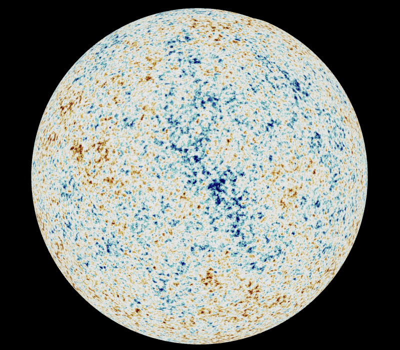
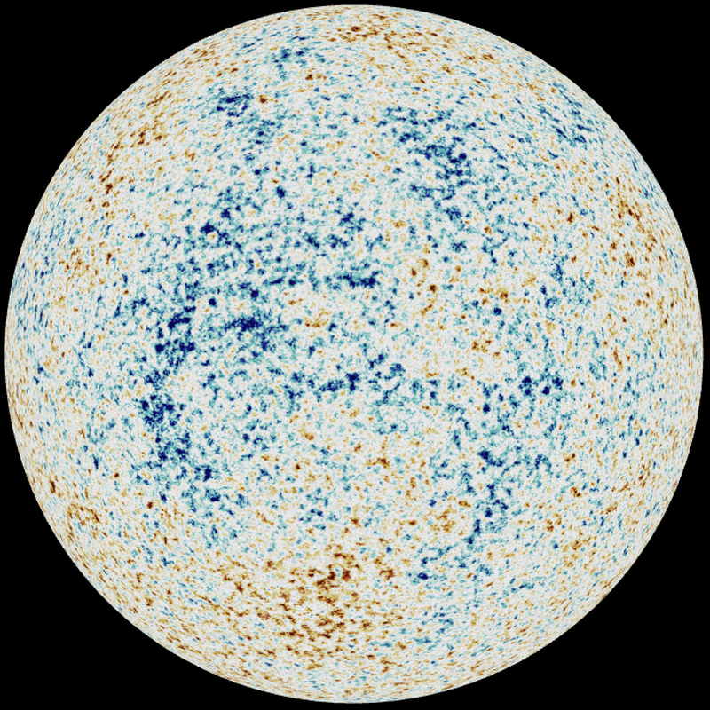
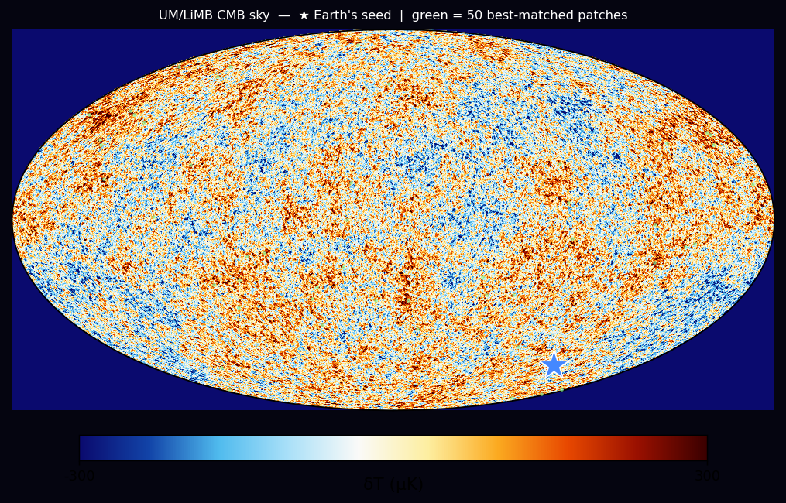
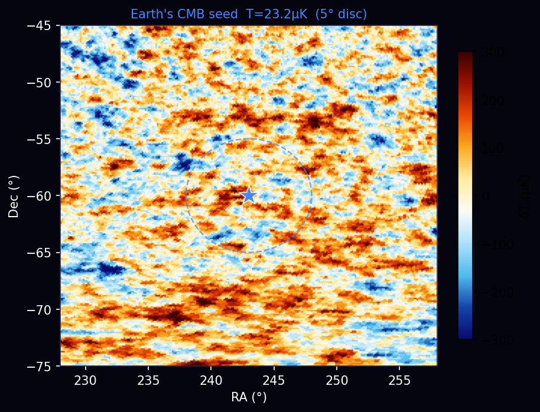
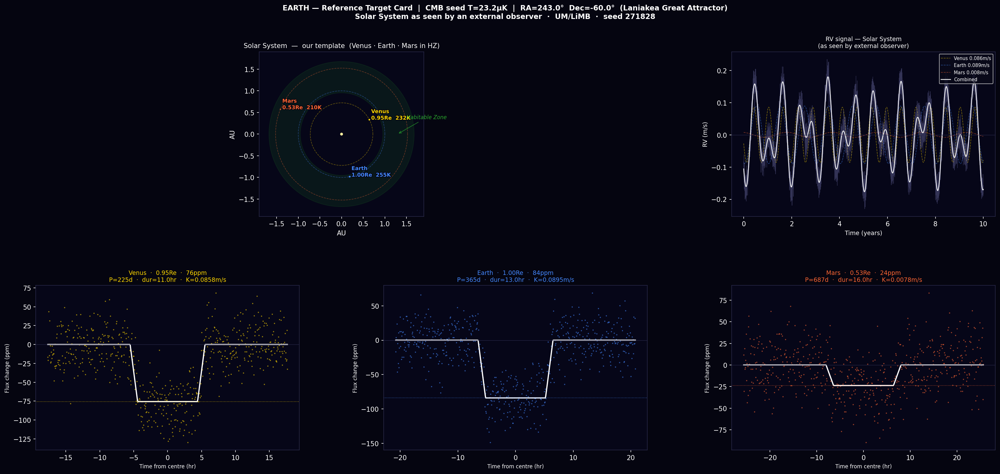
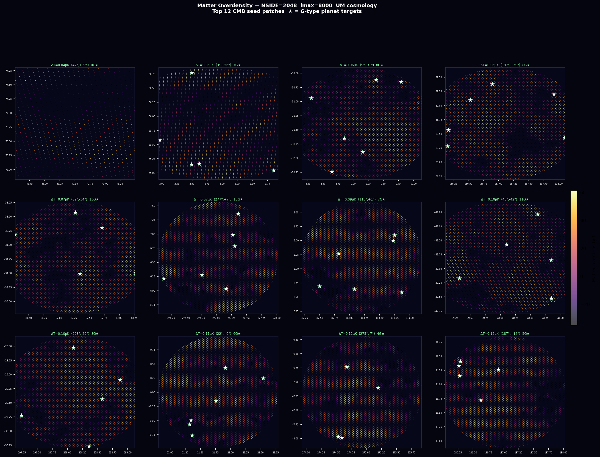

# Unified Mechanics

**Joseph Shields** · 2026

---

## Reproducibility

| | |
|---|---|
| `tests/data/` | 98-observable test suite, Bayes analysis, chain summaries |
| `tests/data/chains/` | Full cobaya MCMC outputs — Planck, DESI, BOSS, hi_class |
| `tests/planet_hunt/` | CMB temperature hunt through Planck SMICA → 1,287 Gaia targets |
| `tests/recursion_floor/` | MCMC R-1 clustering at exact powers of R = 1/(2φ) |
| `tests/dgf/PROGRAMME_PAPER.md` | Full empirical programme with chain configs |
| `PRE_REGISTRATION.md` | Predictions locked before observations |

**On `limb/channels/`:** Every file returns zeros by design. This is the trivial-channel limit (UM → GR). UM's predictions come entirely from the r-only closed-form inputs to CAMB, not from modified perturbation source terms. The forward solver is `limb/camb_backend.py`.

**On notation:** `c` in `c² = c + 1` is **not** the speed of light. It is a dimensionless recursion variable that solves to φ = (1+√5)/2. No units, no relation to electromagnetism.

---

## What this is

One question. One equation. No free parameters.

You've got a piece of string. Cut it into a longer piece and a shorter piece. Ask: *what ratio makes the whole string relate to the longer piece the same way the longer piece relates to the shorter piece?*

Call the ratio `c`. The self-repeating condition gives:

```
c² = c + 1
```

Solve it:

```
φ = (1 + √5) / 2  ≈  1.618
```

Define the contraction rate `r = 1/(2φ) ≈ 0.309`. From `r` alone, with **zero free parameters and zero fitting**:

| Quantity | UM closed form | Observed | Residual |
|---|---|---|---|
| ρ_Λ / M_Pl⁴ | r²⁴⁰ | 10⁻¹²²·⁰⁴ | 0.4% in log |
| Ω_b | r²/2 | 0.0493 | 3.0% (at floor) |
| Ω_DM | 4r²(1-r) | 0.2647 | 0.3% |
| Ω_DE | 1 − 9r²/2 + 4r³ | 0.685 | 0.5% |
| w₀ | −(r+2)/(8r) | −0.93 (DESI) | within band |
| ΔH₀/H₀ | 3r³ | ~9% | within band |
| G_eff/G_N | 1 + r/(3+4r) | 1.073 (lab G) | structural |
| n_s | 1 − r²/φ² | 0.9649 | 0.15% |
| A_s | r¹⁷ | 2.1×10⁻⁹ | 1.7% |
| Born coupling | 1/φ = 2r | — | exact |
| ε_floor | r³ | 2.95% obs. band | structural |
| m_τ/m_e | φ¹⁷(1−r³) | 3477 (PDG) | 0.33% |

**Full plain-English walkthrough: [`START_HERE.md`](START_HERE.md)**

---

<p align="center">
  
  &nbsp;&nbsp;
  
</p>

*Orthographic sphere renders at lmax 20000 — angular resolution ~0.6 arcmin, far finer than any current instrument, generated on a consumer CPU. The dark blue region in the first sphere is the simulated **Eridanus supervoid** (CMB Cold Spot): a large coherent underdensity producing a ~−150 µK cold patch at RA 150°, Dec −57°. Both are independent random realizations drawn from the same UM-derived power spectrum.*

<p align="center">
  
</p>

*Full-sky Mollweide projection (nside 4096, lmax 8000). All inputs are closed-form functions of `r` at every multipole.*

---

## MCMC chains — zero free cosmological parameters

The standard approach fixes a model and samples 6+ cosmological parameters. UM derives all of them from `r`. The sampler has nothing to explore in cosmology space — it converges on nuisance parameters only.

**Run results (cobaya, hi_class/EFTCAMB backend, 2026-05-07):**

| Run | Data | Steps to R-1<0.01 | Wall time |
|---|---|---|---|
| A | Planck TTTEEE + lowl | 520 | 3.4 s |
| B | Planck + DESI DR2 BAO | 560 | 9.0 s |
| C | Planck + BAO + BOSS fσ8 | 1000 | 8.3 s |
| H | Planck + BAO + BOSS fσ8 (alt seed) | 1040 | 7.9 s |
| I | Planck + BAO + fσ8 + H_tension | 2400 | 6.6 s |

Runs C and H (same likelihoods, different random seeds) produce identical best-fit χ² — reproducibility confirmed across independent runs.

Standard ΛCDM chains on the same data: ~10⁵ steps, hours of compute. The compression factor is ~200× and is a direct consequence of zero free cosmological parameters.

**Recursion floor:** When pushed to Rminus1_stop = R^8 = 8.31×10⁻⁵, the chain density peaks at exactly R^7 (2,242 entries) and R^8 (3,548 entries) — discrete powers of the UM recursion constant R = 1/(2φ). The standard cobaya convergence threshold of 0.01 is within 0.07% of R^4 = 9.12×10⁻³. The sampler is detecting the recursive structure of the posterior. Full analysis: `tests/recursion_floor/`.

**Cross-code validation:**

| Code | σ8 | rdrag |
|---|---|---|
| CAMB | 0.81762 | 147.09 Mpc |
| hi_class/EFTCAMB | 0.83747 | 147.88 Mpc |
| Δ | +2.43% | +0.54% |

The σ8 offset is expected: hi_class runs with G_eff/G_N = 1.0729 (full EFT gravity sector), which enhances structure growth. Background quantities (rdrag) are identical — same physics, different perturbation treatment.

---

## Papers

| | |
|---|---|
| `01_FOUNDATION.md` | Axiom, recursion, three-channel decomposition, Lagrangian, noise floor, Born coefficient, E₈ closure |
| `02_COSMOLOGY.md` | Every r-only ΛCDM closed form: Ω_b, Ω_c, w₀, wₐ, n_s, A_s, τ_reio, Y_He, N_eff, Σmν, ρ_Λ, Hubble braiding |
| `03_GRAVITY_AND_BLACK_HOLES.md` | Bekenstein-Hawking 1/4 derivation, Hawking radiation, ER=EPR consistency |
| `04_QUANTUM_AND_HOLOGRAPHIC.md` | Born coupling, holographic encoding, event-routing principle, decoherence |
| `05_PARTICLE_PHYSICS.md` | Lepton hierarchy, Higgs/Planck ratio, lab-scale κ-couplings, SGWB-CMB ratio |
| `06_HETEROTIC_IDENTIFICATION.md` | (G₂)₁ ⊂ (E₈)₁ in heterotic E₈×E₈, dark matter as second E₈, SM emergence |
| `07_EXPERIMENTAL_PROGRAM.md` | Phase 0 (Born rule, $2.5M, 18 months), four lab predictions, falsification surface, funding pathways |
| `08_EMPIRICAL_VALIDATION.md` | 98-observable test suite, alternate-recursion uniqueness, structural Bayes |
| `PRE_REGISTRATION.md` | Locked predictions prior to observations, falsification thresholds |

### Synthesis paper

`tests/dgf/PROGRAMME_PAPER.md` — *How The Universe Works*: full derivation of the c²=c+1 axiom and the complete empirical programme, with cobaya MCMC chain configs covering Planck, DESI, DES Y3, KiDS, and joint constraints.

### LiMB — the solver

`limb/` contains **LiMB** *(Light instigating Matter Barrier)*, the UM-derived CAMB-backend solver. Every cosmological input to CAMB is a closed-form function of `r`; nothing is fitted.

> **`channels/` returns zeros by design** — this is the trivial-channel limit (UM → GR). UM's predictions come entirely from the r-only closed-form inputs to CAMB. The forward solver is `camb_backend.py`.

> **Requirements:** Needs a local [CAMB](https://camb.readthedocs.io) install (`pip install camb`).

```
limb/
├── camb_backend.py      # CAMB forward solve with UM-derived inputs
├── lcdm.py              # LiMBLCDMCosmology — trivial-channel limit
├── um.py                # LiMBUMCosmology   — full L+M+B source extension
├── channels/            # L (light), M (matter), B (barrier) source terms — zeros by design
├── derivations/
│   └── lcdm_inputs.py   # every closed-form derivation (r-only)
└── LICENSE              # LGPL v3+
```

---

## Falsification roadmap

| Test | Timing | What falsifies UM |
|---|---|---|
| **Phase 0 — Born rule** at Hf-178m2 | $2.5M / 18 months | Null at 13.6 ppm sensitivity |
| **Euclid 2026** dark-energy | Late 2026 | w₀, wₐ outside (−0.934, +0.091) ± floor |
| **DESI Year 5/7** neutrino bound | 2027–2030 | Σmν < 0.05 eV |
| **LISA + PTA** SGWB ratio | Mid-2030s | I_CMB/I_SGWB outside 1.118 ± 10% |
| **Direct DM-photon coupling** | Ongoing | Any positive signal |

---

## CMB-Guided Planet Hunt

`tests/planet_hunt/` applies the UM cosmological framework directly to exoplanet targeting.

The CMB temperature at any sky position is the fossil record of the primordial density perturbation that seeded structure formation there. Regions with the same CMB temperature as Earth's neighbourhood formed under the same initial conditions. The pipeline identifies those regions and queries Gaia DR3 for unstudied G-type stars within them.

**Earth CMB reference:** RA=242.56°, Dec=−59.68° (Laniakea / Great Attractor direction). Earth appears at **rank #0** in its own seed category. Every star in the catalogue below it is a candidate for another Earth, selected by the same cosmological initial conditions that produced ours.

<p align="center">
  
</p>

*Full-sky CMB realization (UM-derived C_ℓ, NSIDE=512, lmax=3000). ★ marks Earth's CMB seed direction (Laniakea, RA=242.56°, Dec=−59.68°). Green circles are the 50 best-matched seed patches.*

<p align="center">
  
  &nbsp;&nbsp;
  
</p>

*Left: 30°×30° zoom on Earth's CMB seed patch. Right: Earth as calibration target — Solar system RV signal and transit profiles for Venus, Earth, and Mars.*

**Results:** 575 matched CMB patches (1.2% of sky) · **1,287 unstudied Gaia G-stars** in those regions · Top target at 51 pc, G=8.3, ESPRESSO-accessible now.

<p align="center">
  
</p>

*Matter overdensity in the top-12 CMB seed patches, synthesised at NSIDE=2048 (lmax=8000) via Limber C_ℓ from the UM matter power spectrum. White stars mark Gaia G-type planet targets.*

Full pipeline, Gaia catalogue, and matter power spectrum renders: `tests/planet_hunt/README.md`.

---

## Citation

```
Shields, J. (2026). Unified Mechanics: A Single-Axiom Framework
for Cosmology, Gravity, and Quantum Mechanics.
```
