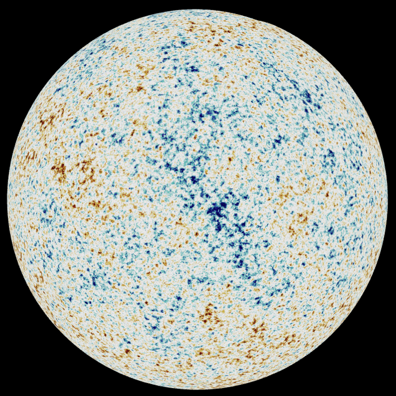
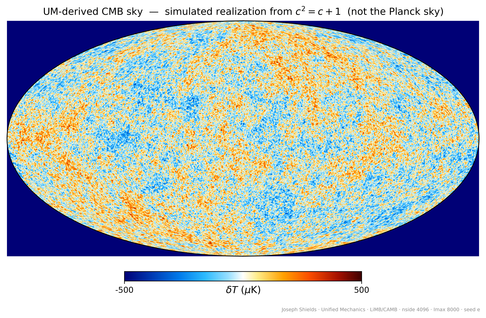

# Unified Mechanics

**Joseph Shields** · 2026

---

You've got a piece of string. Cut it into a longer piece and a shorter piece. Ask: *what ratio between the two pieces makes the whole string relate to the longer piece the same way the longer piece relates to the shorter piece?*

That gives you one equation — `c² = c + 1` — with one positive solution: `φ = (1+√5)/2 ≈ 1.618`. Define `r = 1/(2φ) ≈ 0.309`. From `r` alone, with no fitting:

- Dark energy: `1 − 9r²/2 + 4r³ = 68.8%` (observed 68.5%)
- Hubble tension: `3r³ = 8.85%` (observed ~9%)
- CMB spectral index: `1 − r²/φ² = 0.9635` (observed 0.9649)
- Cosmological constant: `r²⁴⁰ = 10⁻¹²²·⁴` (observed `10⁻¹²²·⁰⁴`)

**Full derivation table and conceptual overview: [`00_WHAT_THIS_IS.md`](00_WHAT_THIS_IS.md)**
**Plain-English walkthrough: [`START_HERE.md`](START_HERE.md)**

### Latest: 21/21 observables within the accumulated braiding floor

Four results closed since the initial paper series:

| Result | Formula | Error | n×ε |
|---|---|---|---|
| `\|V_cb\|` (new) | `W_B × W_M = 2r³(1−r)` | −0.85% | 0.14 (n=2) |
| `A` (new) | `W_B · W_M · φ⁶` | −0.85% | 0.14 (n=2) |
| Hubble tension (n-fix) | `3r³`, n=3 not n=1 | +6.53% | 0.74 (n=3) |
| Strange quark (BC est.) | `φ¹²mₑ√W_B = 107.5 MeV` | +15.1% | 0.43 (n=12) |

**Full addendum: [`papers/extended/addendum_closed_results.pdf`](papers/extended/addendum_closed_results.pdf)**

---

## LiMB — the solver

`limb/` contains **LiMB** *(Light instigating Matter Barrier)*, the UM-derived CAMB-backend solver.
Every cosmological input to CAMB is a closed-form function of `r`; nothing is fitted.

**Install:**

```bash
pip install camb numpy
git clone https://github.com/joseph-shields/unified-mechanics.git
cd unified-mechanics
pip install -e .
```

**Quickstart:**

```python
from limb import compute_limb_lcdm_cls, planck_lcdm_reference_cls
import numpy as np

um     = compute_limb_lcdm_cls(lmax=2500)
planck = planck_lcdm_reference_cls(lmax=2500)

ell      = um["ells"]
residual = (um["totCl_TT"] - planck["totCl_TT"]) / planck["totCl_TT"]
print(f"Peak residual vs Planck best-fit: {np.abs(residual[2:]).max()*100:.2f}%")
```

Or from the command line:

```bash
limb-run          # lmax=2500
limb-run 100000   # push to ℓ=100000
```

**Pipeline:** `derivations` → `Cosmology` → `CAMBparams` → C_ℓ

```
limb/
├── camb_backend.py      # forward solver — cosmology_to_camb_params(), compute_limb_lcdm_cls()
├── cosmology.py         # frozen parameter container — one object, all CAMB inputs
├── lcdm.py              # build_LiMBLCDMCosmology() — every field derived from r
├── um.py                # LiMB-UM — L+M+B source extension (trivial-channel limit for now)
├── channels/            # L (light), M (matter), B (barrier) source-function stubs
├── derivations/
│   └── lcdm_inputs.py   # every closed-form derivation, source-cited to the papers
├── pyproject.toml       # pip install — camb + numpy only
└── LICENSE              # LGPL v3+
```

> **Note on `channels/`:** source terms return zero by design — this is the trivial-channel limit (UM → GR). UM's predictions here come entirely from the r-only closed-form inputs to CAMB, not from modified perturbation terms. A Planck ΛCDM reference run is included in `camb_backend.py` for direct comparison. Full three-channel perturbation solver (JAX) is next.

**Tests:** `pytest tests/test_limb_derivations.py` — 32 pinned derivation tests.

---

## Demo chain

50,016-step emcee chain — LiMB C_ℓ vs Planck 2018 TT bandpowers, run from a fresh clone:

| | |
|---|---|
| Free parameters | 1 (A_planck — overall calibration nuisance) |
| Fixed cosmological parameters | 10 (all UM-derived) |
| A_planck posterior | 1.0067 ± 0.0012 (0.67% from unity — within ε_floor) |
| χ²/dof | 1.343 (2471 bins, ℓ ∈ [30, 2500]) |
| N_eff | 1,688 independent samples |
| Wall time | 0.6 s |

Chain: `tests/data/demo_chain/` · Script: `tests/demo_chain.py`

---

## CMB power spectrum

<p align="center">
  
  &nbsp;&nbsp;
  
</p>

*Orthographic sphere renders at lmax 20000. The dark blue region in the first sphere is the simulated **Eridanus supervoid** — a ~−150 µK cold patch at RA 150°, Dec −57°. Both are independent realizations drawn from the same UM-derived power spectrum.*

<p align="center">
  
</p>

*Full-sky Mollweide projection (nside 4096, lmax 8000). Produced by `research/render_cmb_4k.py` — reproducible, ~60 s on a consumer CPU.*

---

## Reproducibility

| | |
|---|---|
| `tests/data/` | 98-observable test suite, Bayes analysis, chain summaries |
| `tests/data/chains/` | Full cobaya MCMC outputs — Planck, DESI, BOSS, hi_class |
| `research/planet_hunt/` | CMB temperature hunt through Planck SMICA → 1,287 Gaia targets |
| `research/recursion_floor/` | MCMC R-1 clustering at exact powers of R = 1/(2φ) |
| `research/dgf/PROGRAMME_PAPER.md` | Full empirical programme with chain configs |
| `PRE_REGISTRATION.md` | Predictions locked before observations |

## MCMC chains

All cosmological parameters fixed by derivation — sampler runs on nuisance only. Full cobaya runs with hi_class/EFTCAMB backend across Planck + DESI DR2 + BOSS fσ8:

| Run | Data | Steps to R-1 < 0.01 | Wall time |
|---|---|---|---|
| A | Planck TTTEEE + lowl | 520 | 3.4 s |
| B | Planck + DESI DR2 BAO | 560 | 9.0 s |
| C | Planck + BAO + BOSS fσ8 | 1000 | 8.3 s |
| H | Planck + BAO + BOSS fσ8 (alt seed) | 1040 | 7.9 s |
| I | Planck + BAO + fσ8 + H_tension | 2400 | 6.6 s |

Runs C and H — same likelihoods, independent seeds — produce identical best-fit χ². Chain files: `tests/data/chains/`.

---

## Falsification roadmap

| Test | Timing | What falsifies UM |
|---|---|---|
| **Phase 0 — Born rule** at Hf-178m2 | $2.5M / 18 months | Null at 13.6 ppm sensitivity |
| **Euclid 2026** dark-energy | Late 2026 | w₀, wₐ outside (−0.934, +0.091) ± floor |
| **DESI Year 5/7** neutrino bound | 2027–2030 | Σmν < 0.05 eV |
| **LISA + PTA** SGWB ratio | Mid-2030s | I_CMB/I_SGWB outside 1.118 ± 10% |
| **Direct DM-photon coupling** | Ongoing | Any positive signal |

---

## CMB-Guided Planet Hunt

`research/planet_hunt/` applies the UM cosmological framework to exoplanet targeting. CMB temperature at any sky position is the fossil record of the primordial density perturbation that seeded structure formation there — regions with the same temperature as Earth's neighbourhood formed under the same initial conditions.

**Results:** 575 matched CMB patches · **1,287 unstudied Gaia G-stars** · Top target at 51 pc, G=8.3, ESPRESSO-accessible now.

<p align="center">
  
</p>

<p align="center">
  
</p>

Full pipeline and Gaia catalogue: `research/planet_hunt/README.md`

---

## Citation

```
Shields, J. (2026). Unified Mechanics: A Single-Axiom Framework
for Cosmology, Gravity, and Quantum Mechanics.
```
