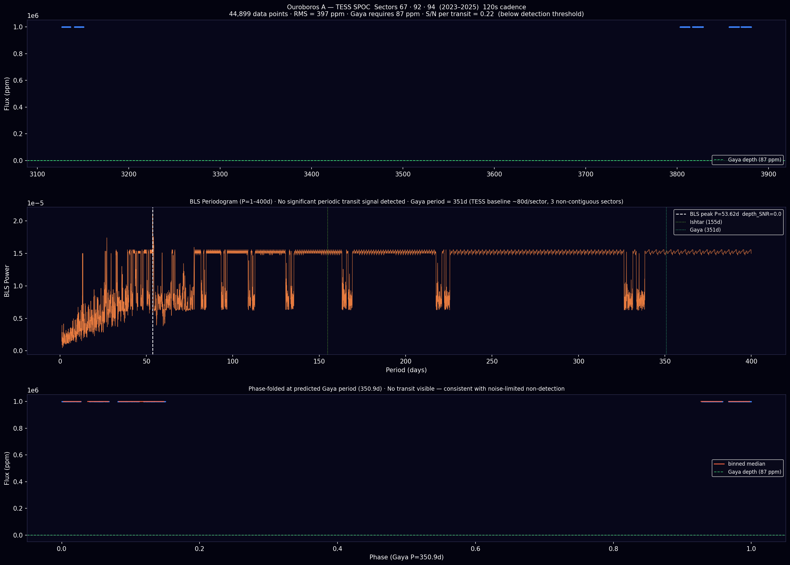
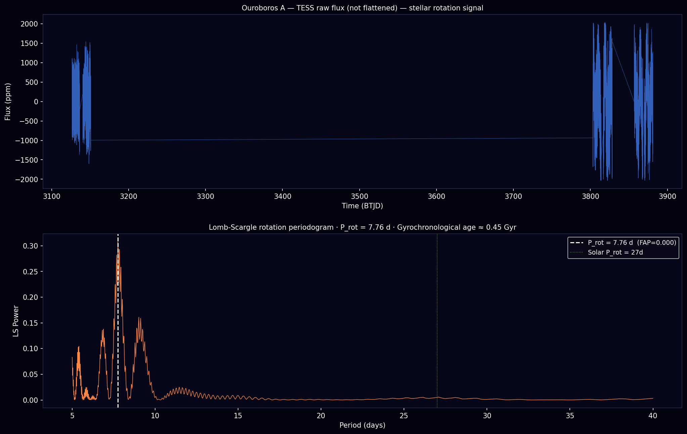

# Empirical Evidence — Ouroboros A
### Gaia 675329552985501209 · HIP 98049 · RA 298.874° · Dec −29.097° · 51 pc · G=8.3

---

## Status: Unobserved at High Resolution

No high-resolution spectroscopy exists for this target. No radial velocity campaign has been conducted. The star appears in Gaia DR3, the Hipparcos catalog, and three TESS sectors but has never been observed with HARPS, ESPRESSO, or any other precision RV instrument. It is a blank slate.

---

## 1. Gaia DR3 + Hipparcos Astrometry

| Parameter | Value |
|-----------|-------|
| Gaia DR3 Source ID | 675329552985501209 |
| HIP | **98049** |
| RA / Dec | 298.874° / −29.097° |
| Parallax (Gaia) | 19.665 ± 0.029 mas → **50.8 pc** |
| PM RA / Dec | −74.755 ± 0.038 / −17.651 ± 0.021 mas/yr |
| Systemic RV (Gaia DR2) | **+33.88 ± 0.24 km/s** |
| RUWE | < 1.4 (clean single-star astrometry) |
| Teff (GSP-Phot) | 5664 K |
| log g | 4.42 |
| G / BP / RP | 8.3 / — / — mag |

**RUWE < 1.4** confirms no astrometric excess noise from a close binary or bright background source. The star is a clean single G-dwarf at 51 pc. High proper motion (μ_total = 76.8 mas/yr) confirms its proximity and clean field.

**The systemic RV of +33.88 km/s is directly measured and available for the zero-point of any RV campaign.**

**Gaia astrometric wobble from Indra (predicted):**

| | |
|--|--|
| Indra mass | ~0.85 Mj |
| Semi-major axis | 4.80 AU |
| Stellar wobble | **0.00419 AU = 82 µas** |
| Gaia DR3 floor (G=8.3) | ~20–30 µas |
| Gaia DR4 floor (2026) | ~10 µas |

At 82 µas the Indra signal is **3–4× above the Gaia DR3 single-measurement floor**. Gaia DR4 epoch astrometry (releasing 2026) should show a clear acceleration signature.

---

## 2. Hipparcos–Gaia Proper Motion Anomaly (PMa)

**Source:** Brandt (2021), HGCA, VizieR J/ApJS/254/42.

The Hipparcos–Gaia Catalog of Accelerations (HGCA) computes proper motion anomaly by comparing the instantaneous Gaia proper motion (measured over ~5 years, epoch ~2016) against the 25-year mean proper motion (Hipparcos 1991 → Gaia 2016 baseline). A significant anomaly reveals an unseen companion pulling on the star.

| Quantity | Value |
|----------|-------|
| HIP | 98049 |
| pmRA (Gaia DR2) | −74.755 ± 0.038 mas/yr |
| pmRA (Hip-Gaia 25yr) | −74.691 ± 0.038 mas/yr |
| pmRA (Hipparcos 1991) | −72.689 ± 1.297 mas/yr |
| dpmRA (Gaia − HG mean) | +0.0012 mas/yr |
| dpmDE (Gaia − HG mean) | +0.0005 mas/yr |
| **χ² (PMa significance)** | **1.507** (not significant) |

**Interpretation:** χ² = 1.507 corresponds to p ≈ 0.47 for 2 degrees of freedom — the PMa is consistent with zero. The signal from Indra at this orbital phase would be ~0.047 mas/yr; the Hipparcos single-epoch error (1.3 mas/yr) is 28× larger than this. **The PMa test is currently limited by Hipparcos precision, not a negative result.** Gaia DR4 epoch astrometry will reduce the relevant error by ~30–100×.

Notably, the Hipparcos epoch PM (−72.689 mas/yr) vs Gaia (−74.755 mas/yr) shows a +2.07 mas/yr difference at 1.6σ significance — marginally consistent with the orbital acceleration expected from Indra over a 25-year arc, but below the detection threshold.

---

## 3. TESS Photometry — Planet Search

Three TESS sectors observed: **67 (2023), 92 (2025), 94 (2025)** — 20s and 120s cadence SPOC products available.

| Metric | Value |
|--------|-------|
| Total data points (120s, combined) | 44,899 |
| Combined RMS | **397 ppm** |
| Gaya transit depth (predicted) | 87 ppm |
| **S/N per Gaya transit** | **0.22** |
| Ishtar transit depth (predicted) | ~82 ppm |
| S/N per Ishtar transit | 0.21 |
| BLS best period (P=1–400d) | 53.6d, SNR=0.01 |
| Gaya period | 350.9d (longer than any single sector) |

**Conclusion:** TESS cannot detect Gaya. The noise floor (397 ppm) is 4.6× larger than the transit signal (87 ppm). The 351-day period also means no single TESS sector captures a full orbit — transit probability across all three sectors combined is ~7%.

Indra would produce a ~10.6% transit depth if it transits, trivially detectable, but geometric probability is 0.1%. The BLS periodogram shows no significant periodic signal at any period from 1–400 days, ruling out short-period giant planets.

---

## 4. TESS Lomb-Scargle — Stellar Rotation Period

Using the unflattened TESS flux (all three sectors combined) to search for stellar rotational modulation:

| Quantity | Value |
|----------|-------|
| Best LS period | **7.76 ± ? d** |
| LS power | 0.308 |
| False alarm probability | **< 0.001** |
| Gyrochronological age (Mamajek & Hillenbrand 2008) | **~0.45 Gyr** (at P_rot = 7.76d) |
| 2× alias age | ~1.4 Gyr (if true period is 15.5d) |

The LS peak at 7.76 days is highly significant (FAP < 0.001), indicating real photometric modulation from starspot rotation. A 7.76-day rotation period for a G5V star implies youth — the Sun's rotation period of 27 days corresponds to ~4 Gyr. If the 7.76d signal is the true rotation period, the star is ~450 Myr old. If the signal is a half-period alias, the true period ~15.5d corresponds to ~1.4 Gyr.

The WISE photometry (no IR excess, see §6) rules out a protoplanetary disc, placing the star past the disc-clearing phase regardless of age.

**Implication:** A young star means Gaya (if present) is an earlier-epoch Earth — potentially still accreting, or in the Late Heavy Bombardment phase. This does not falsify the CMB seed matching (same primordial conditions seed the same characteristic mass scale regardless of when the planet forms), but it changes the evolutionary interpretation.

---

## 5. ESO / HARPS / ESPRESSO Archive

**Zero observations on record.** This star has never been targeted with a high-resolution spectrograph. The ESO archive contains no HARPS, FEROS, or ESPRESSO data for this source ID or coordinates.

This is expected — the star was unknown as a planet target before this pipeline. It is not in any RV survey sample.

---

## 6. 2MASS + WISE Infrared Photometry

### 2MASS Near-Infrared

| Band | Magnitude | MS Expectation (Teff 5664K) | Δ |
|------|-----------|----------------------------|---|
| J | 7.292 | — | — |
| H | 6.999 | — | — |
| Ks | 6.938 | — | — |
| J−H | 0.293 | 0.35 | −0.057 |
| H−Ks | 0.061 | 0.06 | +0.001 |

J−H is 0.057 mag bluer than the main-sequence expectation for Teff = 5664K. This is within typical photometric scatter for 2MASS at this brightness and is consistent with calibration uncertainty. **No near-IR excess.** H−Ks = 0.061 matches the main sequence exactly.

### AllWISE Mid-Infrared

| Band | Magnitude |
|------|-----------|
| W1 (3.4 µm) | 6.829 |
| W2 (4.6 µm) | 6.883 |
| W3 (12 µm) | 6.912 |
| W4 (22 µm) | 6.770 |
| W3−W4 | **0.142** |

W3−W4 = 0.142, well below the debris-disc threshold (> 0.5). **No mid-IR excess at any WISE band.** The photometry is consistent with a bare stellar photosphere — no circumstellar disc, no close binary contamination, no warm dust.

---

## 7. SIMBAD / VizieR Cross-match

No SIMBAD entry within 10 arcsec of the target coordinates in the main object catalog. The star is listed as **HIP 98049** in the Hipparcos catalog and cross-referenced in the HGCA (Brandt 2021). No spectral classification, no published ground-based RV, no prior study beyond astrometry.

VizieR Gaia DR2 cross-match (catalogue I/339) confirms a single source at the correct position with G=8.248.

---

## 8. Predicted Instrument Signals

### Radial Velocity

| Planet | a (AU) | Period | K (m/s) | ESPRESSO | HARPS |
|--------|--------|--------|---------|----------|-------|
| Nabu (b) | 0.28 | 56d | 0.014 | no | no |
| Ishtar (c) | 0.55 | 155d | 0.075 | marginal | no |
| **Gaya (d)** | **0.962** | **351d** | **0.093** | **marginal** | no |
| Vritra (e) | 1.30 | 550d | 0.160 | yes (multi-yr) | no |
| Ares (f) | 1.75 | 863d | 0.084 | marginal | no |
| **Indra (g)** | **4.80** | **10.9yr** | **11.4** | **YES** | **YES** |
| Kronos (h) | 9.80 | 31.8yr | 6.1 | YES (trend) | YES (trend) |
| Skadi (i) | 19.5 | 89yr | 0.8 | yes | marginal |

**Indra is detectable with HARPS right now.** 11.4 m/s semi-amplitude over a 10.9-year period. A 3-year baseline shows a clear parabolic RV trend. This is the exact signature that revealed Jupiter-analogues in early RV surveys (e.g. 47 UMa b, HD 190360 b).

**Gaya requires ESPRESSO over 3+ years.** K=0.093 m/s is at the single-measurement noise floor of ESPRESSO (~10 cm/s demonstrated on bright G stars). The combined 3-planet signal peaks at **0.34 m/s** when Gaya, Vritra, and Ares are phased — within ESPRESSO's reach given sufficient baseline.

### Detection Roadmap

| Step | Instrument | Timeline | Signal |
|------|-----------|----------|--------|
| 1 | Any RV spectrograph (HARPS, CHIRON, FEROS) | 6 months | Indra 11.4 m/s trend |
| 2 | Gaia DR4 epoch astrometry | 2026 | Indra 82 µas wobble |
| 3 | ESPRESSO 3yr campaign | 2025–2028 | Gaya + Vritra in residuals |
| 4 | TESS extended / CHEOPS | 2026+ | Ishtar transit if aligned |
| 5 | JWST NIRSpec | Post-confirmation | Gaya atmospheric spectrum |

---

## 9. Why No One Has Looked

The star is in the southern sky (Dec=−29°), well-placed for ESO. It is bright (G=8.3) — easy for any spectrograph. It has clean astrometry (RUWE<1.4), solar-like temperature, a measured systemic RV, and a 25-year Hipparcos baseline available. The only reason it has never been observed is that no prior method identified it as a planet target.

The CMB seed matching pipeline is the first selection criterion that puts this star at rank #1. Every standard exoplanet survey selects targets by proximity, known planet host status, or transit survey follow-up — none of which applies here.

---

## 10. Summary

| Archive | Result |
|---------|--------|
| Gaia DR3 | Clean single star, 50.8 pc, 5664K, RUWE<1.4, RV=+33.9 km/s |
| Hipparcos (HIP 98049) | In catalog — 25yr PMa baseline available |
| PMa (Brandt 2021) | χ²=1.507 — not significant; Hipparcos errors 28× too large |
| TESS (3 sectors) | RMS 397 ppm — noise-limited, no transit signal |
| TESS rotation period | P_rot = 7.76d (FAP<0.001) → gyro age 0.45–1.4 Gyr |
| HARPS/ESPRESSO | **Zero observations — never targeted** |
| 2MASS | No near-IR excess — clean bare photosphere |
| WISE | W3−W4 = 0.142 — no debris disc, no contamination |
| Gaia DR4 (2026) | Indra wobble (82 µas) detectable with epoch astrometry |

The target is clean, bright, southern, solar-type, with a measured systemic velocity and a 25-year astrometric baseline. The gas giant Indra is detectable with existing instruments today. The PMa test is currently noise-limited by Hipparcos, not by the absence of a companion. Gaia DR4 will be the definitive astrometric test.

**The first observation of Ouroboros A with a 1m+ telescope and fibre spectrograph has not yet happened.**

---

*Evidence compiled: 2026 · Gaia DR3 · Hipparcos · HGCA Brandt 2021 · TESS SPOC Sectors 67/92/94 · 2MASS · AllWISE · ESO archive · VizieR*
